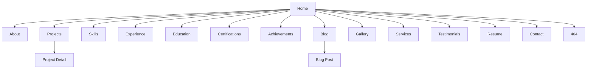
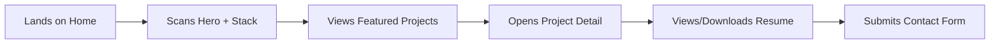
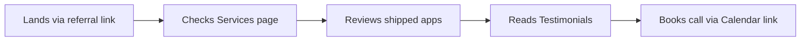
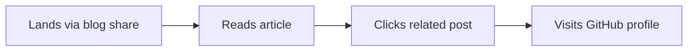

# Product Requirements Document (PRD)
## Personal Portfolio Website — Mobile Developer (Entry-Level)

**Version:** 1.0
**Owner:** [Your Name]
**Status:** Draft for Review
**Last Updated:** July 2026

---

## 1. Executive Summary

A premium, minimal, high-performance personal portfolio website for an entry-level Mobile Developer (iOS / Android / Cross-platform). The site's primary goal is to convert recruiter/hiring-manager attention into interviews by presenting projects, skills, and credibility signals (GitHub, App Store links, case studies) in a fast, accessible, beautifully designed experience — comparable in polish to Vercel, Linear, or Raycast's marketing sites.

**Primary goal:** Get hired as a Mobile Developer.
**Secondary goals:** Build personal brand, attract freelance/internship offers, demonstrate product thinking (not just code).

---

## 2. Goals & Success Metrics (KPIs)

| Goal | Metric | Target |
|---|---|---|
| Recruiter engagement | Avg. session duration | > 90 seconds |
| Conversion to contact | Contact form submissions / visitor | > 3% |
| CV downloads | Downloads / visitor | > 8% |
| Performance | Lighthouse Performance score | ≥ 95 |
| Accessibility | Lighthouse Accessibility score | 100 |
| SEO | Lighthouse SEO score | 100 |
| Mobile usability | Mobile Lighthouse score | ≥ 95 |
| Discoverability | Indexed on Google within | 7 days of launch |
| Project engagement | Avg. project detail views / session | ≥ 2 |

---

## 3. Target Audience & Personas

| Persona | Need | Key Content They Look For |
|---|---|---|
| **Technical Recruiter** | Fast keyword scan | Skills, years of experience, stack, location, resume |
| **Engineering Manager** | Code quality signal | GitHub, architecture explanations, problem-solving narrative |
| **Startup Founder** | Can this person ship? | Shipped apps (App Store/Play Store links), speed of execution |
| **University Career Office** | Credibility | Education, certifications, academic projects |
| **Fellow Developers** | Learning/inspiration | Blog, open-source contributions |

---

## 4. Assumptions

- User has 0–1 years of professional experience but has shipped personal/academic mobile projects.
- Primary stack likely includes Swift/SwiftUI and/or Kotlin/Jetpack Compose and/or Flutter/React Native (to be confirmed).
- Hosting budget is near-zero (static hosting preferred).
- Single maintainer (no CMS team); content updates happen via Git commits or a lightweight headless CMS.
- English is the primary language (i18n not in v1 scope).

## 5. Risks

| Risk | Mitigation |
|---|---|
| Portfolio looks generic/templated | Custom design system, no default UI-kit look, distinctive type + motion |
| Thin project content (entry-level) | Depth over breadth — 2-3 case studies with real problem/solution narrative beats 10 shallow ones |
| Slow mobile performance | Static generation, image optimization, lazy loading, minimal JS |
| Poor SEO discoverability | Structured data, sitemap, semantic HTML, meta strategy (Section 12) |
| Outdated content over time | Git-based content (MDX) so updates are low-friction |

---

## 6. Information Architecture



### Navigation Model
- **Primary nav (sticky):** Home · Projects · About · Blog · Contact
- **Secondary/footer nav:** Skills · Experience · Education · Certifications · Resume · Services
- Single-page sections for Home (scroll-linked anchors) + dedicated routes for deep content (Projects, Blog, Resume).

---

## 7. Sitemap

```
/                      → Home
/about                 → About
/projects              → Projects (grid, filterable)
/projects/[slug]       → Project Detail
/skills                → Skills matrix
/experience            → Experience timeline
/education             → Education
/certifications        → Certifications
/achievements          → Achievements
/blog                  → Blog index
/blog/[slug]           → Blog post
/gallery               → Screenshots/UI shots
/services              → Freelance/availability
/testimonials          → Testimonials
/resume                → Resume (view + download)
/contact               → Contact
/404                   → Not found
```

---

## 8. User Flows

### 8.1 Recruiter Flow (Primary)


### 8.2 Founder/Client Flow


### 8.3 Developer/Peer Flow


**Acceptance criteria (all flows):** every terminal action (download, submit, click-out) must be reachable within 3 clicks from Home, and every page must expose a persistent path back to Contact.

---

## 9. Functional Requirements

| ID | Requirement | Priority | Acceptance Criteria |
|---|---|---|---|
| FR-01 | Responsive navigation with mobile hamburger menu | P0 | Works at 320px–2560px; keyboard operable |
| FR-02 | Dark/Light mode toggle with system preference detection | P0 | Persists via `localStorage`-equivalent state or cookie; no flash of unstyled theme |
| FR-03 | Project filtering by tag/tech/platform (iOS/Android/Cross-platform) | P0 | Filters combine with AND logic; URL reflects filter state (`?tech=swiftui`) |
| FR-04 | Downloadable CV (PDF) | P0 | One-click download, filename `FirstName-LastName-CV.pdf`, tracked via analytics event |
| FR-05 | Contact form (name, email, message, budget optional) | P0 | Client + server-side validation; spam protection (honeypot or CAPTCHA); success/error states |
| FR-06 | Blog with search, categories, tags, reading time, TOC | P1 | Search returns results in < 300ms client-side; TOC auto-generated from headings |
| FR-07 | Syntax highlighting for code blocks in blog | P1 | Supports Swift, Kotlin, Dart, JS/TS at minimum |
| FR-08 | Social share buttons on blog posts | P2 | Twitter/X, LinkedIn, copy-link |
| FR-09 | Related posts recommendation | P2 | Based on shared tags, min. 2 max. 3 shown |
| FR-10 | SEO metadata per page (title, description, OG, Twitter Card) | P0 | Every route has unique title/description; validated via Lighthouse SEO audit |
| FR-11 | Newsletter signup (optional) | P3 | Integrates with email provider (e.g., Buttondown/ConvertKit) |
| FR-12 | Analytics integration | P0 | Privacy-respecting (e.g., Plausible/Vercel Analytics); no cookie banner needed if cookieless |
| FR-13 | Calendar booking link on Contact/Services | P2 | Embeds Cal.com/Calendly widget or deep link |
| FR-14 | Image/screenshot gallery with lightbox | P1 | Keyboard navigable, lazy-loaded, alt text required |
| FR-15 | 404 page with navigation back to Home | P0 | Custom illustration, links to Home + Projects |
| FR-16 | App Store / Play Store badges on shipped projects | P0 | Opens store listing in new tab, `rel="noopener"` |

---

## 10. Non-Functional Requirements

| Category | Requirement |
|---|---|
| **Performance** | LCP < 1.8s, CLS < 0.1, TBT < 150ms on 4G mid-tier mobile device |
| **Accessibility** | WCAG 2.1 AA compliant across all pages |
| **Maintainability** | Content in MDX/JSON, no hardcoded copy in components; documented component library |
| **Security** | HTTPS only, CSP headers, form input sanitization, no secrets in client bundle |
| **Scalability** | Static-first architecture (SSG/ISR) — scales to spike traffic (e.g., HN/Reddit front page) with zero server strain |
| **Availability** | 99.9% uptime (CDN-backed static hosting) |
| **Reliability** | Graceful degradation if analytics/CMS APIs fail — content still renders |
| **SEO** | Fully crawlable without JS execution required (SSR/SSG) |
| **Browser support** | Last 2 versions of Chrome, Safari, Firefox, Edge; iOS Safari 15+ |
| **Code quality** | TypeScript strict mode, ESLint + Prettier, CI checks on PR |

---

## 11. Design System

### 11.1 Design Principles
1. **Content-first** — design recedes so work is the hero.
2. **Purposeful motion** — every animation communicates state, never decoration for its own sake.
3. **Native-feeling on mobile** — since this is a mobile dev's portfolio, the site itself should feel app-like on phones (smooth transitions, thumb-friendly tap targets ≥ 44px).
4. **Restraint** — one accent color, generous whitespace, max 2 typefaces.

### 11.2 Color Tokens

```css
:root {
  /* Primary */
  --color-primary-50:  #eef4ff;
  --color-primary-100: #d9e6ff;
  --color-primary-300: #93b4ff;
  --color-primary-500: #3b6cff;  /* Brand accent */
  --color-primary-700: #1f3fbf;
  --color-primary-900: #14235c;

  /* Neutral / Surface */
  --color-bg:            #ffffff;
  --color-bg-subtle:     #f7f8fa;
  --color-surface:       #ffffff;
  --color-surface-raised:#ffffff;
  --color-border:        #e5e7eb;
  --color-border-strong: #d1d5db;

  /* Text */
  --color-text-primary:   #0a0a0c;
  --color-text-secondary: #52525b;
  --color-text-tertiary:  #9498a1;
  --color-text-inverse:   #ffffff;

  /* Semantic */
  --color-success: #16a34a;
  --color-warning: #d97706;
  --color-danger:  #dc2626;
  --color-info:    #2563eb;

  /* Interaction states */
  --color-hover:    rgba(59,108,255,0.08);
  --color-active:   rgba(59,108,255,0.16);
  --color-focus:    #3b6cff;
  --color-disabled: #d1d5db;
}

[data-theme="dark"] {
  --color-bg:            #0a0a0c;
  --color-bg-subtle:     #111114;
  --color-surface:       #16161a;
  --color-surface-raised:#1c1c21;
  --color-border:        #26262c;
  --color-border-strong: #34343c;

  --color-text-primary:   #f5f5f7;
  --color-text-secondary: #a1a1aa;
  --color-text-tertiary:  #6b6b74;
  --color-text-inverse:   #0a0a0c;

  --color-hover:  rgba(147,180,255,0.08);
  --color-active: rgba(147,180,255,0.16);
}
```

### 11.3 Typography

| Role | Font | Size (Desktop) | Size (Mobile) | Weight | Line Height | Letter Spacing |
|---|---|---|---|---|---|---|
| Display (Hero) | Geist / Inter | 64px | 40px | 700 | 1.05 | -0.02em |
| H1 | Geist / Inter | 44px | 32px | 700 | 1.1 | -0.02em |
| H2 | Geist / Inter | 32px | 26px | 600 | 1.2 | -0.01em |
| H3 | Geist / Inter | 24px | 20px | 600 | 1.3 | 0 |
| Body Large | Inter | 18px | 16px | 400 | 1.6 | 0 |
| Body | Inter | 16px | 15px | 400 | 1.6 | 0 |
| Caption | Inter | 14px | 13px | 500 | 1.4 | 0.01em |
| Code | JetBrains Mono | 14px | 13px | 400 | 1.5 | 0 |

**Font stack:** Headings — `Geist, Inter, -apple-system, sans-serif`; Body — `Inter, -apple-system, sans-serif`; Code — `'JetBrains Mono', 'Fira Code', monospace`.

### 11.4 Spacing Scale (4px base)
`4, 8, 12, 16, 24, 32, 48, 64, 96, 128` px

### 11.5 Component Inventory

| Component | States Required |
|---|---|
| Button (primary/secondary/ghost) | default, hover, active, focus, disabled, loading |
| Card (project/blog) | default, hover (lift + shadow), skeleton |
| Navbar | default, scrolled (blurred bg), mobile-open |
| Footer | — |
| Modal / Dialog | open, closing (animated exit) |
| Input / Textarea | default, focus, error, disabled |
| Dropdown / Select | closed, open, selected |
| Tabs | active, inactive, hover |
| Accordion | collapsed, expanded |
| Timeline (experience) | — |
| Badge / Chip (tech tags) | default, active (filter selected) |
| Toast | success, error, info |
| Tooltip | — |
| Pagination | — |
| Breadcrumb | — |
| Avatar | with image, initials fallback |
| Skeleton loader | — |
| Empty state | — |
| Loading state | spinner, progress |

---

## 12. Responsive Rules

| Breakpoint | Width | Layout Notes |
|---|---|---|
| `xs` | < 480px | Single column, stacked nav, 16px gutters |
| `sm` | 480–767px | Single column, larger touch targets |
| `md` | 768–1023px | 2-column project grid, nav collapses to hamburger at 767px |
| `lg` | 1024–1439px | 3-column project grid, full desktop nav |
| `xl` | ≥ 1440px | Max content width 1200px, centered, generous margins |

Touch targets ≥ 44×44px on all breakpoints below `lg`. Images use `srcset`/responsive `sizes` for all breakpoints.

---

## 13. Animation Guidelines

| Interaction | Animation | Duration | Easing |
|---|---|---|---|
| Page transition | Fade + 8px slide-up | 250ms | `cubic-bezier(0.16,1,0.3,1)` |
| Card hover | Lift 4px + shadow increase | 180ms | ease-out |
| Button press | Scale 0.97 | 100ms | ease-in-out |
| Scroll reveal | Fade + 16px slide-up on intersection | 400ms | ease-out, staggered 60ms per item |
| Nav mobile open | Slide-in from right + backdrop fade | 300ms | ease-out |
| Loading skeleton | Shimmer gradient sweep | 1.4s loop | linear |
| Route/tab switch | Cross-fade | 200ms | ease |

**Rule:** All animations respect `prefers-reduced-motion` — reduce to opacity-only fades ≤ 150ms.

---

## 14. SEO Strategy

- **Meta title pattern:** `{Page Title} — {Full Name} | Mobile Developer`
- **Meta description:** Unique per page, 150–160 chars, includes primary keyword ("Mobile Developer", "iOS Developer", "Flutter Developer" as applicable).
- **Open Graph:** Custom 1200×630 OG image per page (auto-generated via `@vercel/og` or similar for blog posts).
- **Twitter Card:** `summary_large_image`.
- **Schema.org structured data:** `Person` schema on About/Home, `Article` schema on blog posts, `BreadcrumbList` on nested pages.
- **Sitemap.xml:** Auto-generated at build time, submitted to Google Search Console.
- **Robots.txt:** Allow all except any `/draft/` or admin routes.
- **Canonical URLs:** Set on every page to prevent duplicate content issues (especially blog tag/category pages).

---

## 15. Accessibility Requirements (WCAG 2.1 AA)

| Requirement | Implementation |
|---|---|
| Color contrast | Text ≥ 4.5:1, large text/UI components ≥ 3:1 (verified against both light/dark tokens) |
| Keyboard navigation | All interactive elements reachable via Tab, visible focus ring using `--color-focus` |
| ARIA labels | Icon-only buttons (theme toggle, hamburger, social icons) have `aria-label` |
| Screen reader | Semantic HTML5 landmarks (`<nav>`, `<main>`, `<footer>`), skip-to-content link |
| Focus states | Never removed via `outline: none` without a replacement focus style |
| Reduced motion | `@media (prefers-reduced-motion: reduce)` disables non-essential animation |
| Form accessibility | Labels programmatically associated with inputs, error messages linked via `aria-describedby` |
| Alt text | Required field for every project screenshot and gallery image |

---

## 16. Portfolio Content Structure (Home Page Sections)

1. **Hero** — Name, one-line value prop ("Mobile Developer crafting fast, delightful iOS/Android apps"), primary CTA (View Projects) + secondary CTA (Download CV).
2. **Tech Stack strip** — Logo row: Swift, Kotlin, Flutter/React Native (as applicable), Firebase, REST/GraphQL, CI/CD tools.
3. **Featured Projects** — 3 best case studies, each with cover image, one-line problem statement, tech badges.
4. **Experience Summary** — Condensed timeline (internships, freelance, academic work).
5. **Statistics** — e.g., "X apps shipped", "X GitHub repos", "X% crash-free rate" (only real, verifiable numbers).
6. **Skills** — Grouped: Languages, Frameworks, Tools, Platforms.
7. **Testimonials** — From mentors, professors, freelance clients, hackathon teammates.
8. **Latest Articles** — 3 most recent blog posts.
9. **Call to Action** — "Let's build something" + Contact button.
10. **Footer** — Social links, quick nav, email, copyright.

### Project Detail Template
Overview → Problem → Solution → Tech/Architecture (with diagram) → Key Screens (screenshots) → Features → Challenges & Learnings → Results/Metrics → Links (GitHub, App Store/Play Store, Case Study PDF) → Future Improvements.

---

## 17. Recommended Tech Stack

| Layer | Recommendation | Why |
|---|---|---|
| Frontend framework | Next.js 15 (App Router) | SSG/ISR for SEO + performance |
| Styling | Tailwind CSS + CSS variables (design tokens above) | Fast iteration, consistent tokens |
| Content | MDX + Contentlayer, or a headless CMS (Sanity/Contentful) if non-technical editing is needed | Git-based content = zero cost, versioned |
| Deployment | Vercel | Zero-config, edge CDN, preview deployments |
| Database (if needed for contact form storage) | Supabase / PlanetScale | Free tier sufficient for portfolio scale |
| Contact form backend | Resend / Formspree | No custom backend needed |
| Analytics | Plausible or Vercel Analytics | Privacy-first, no cookie banner |
| Image optimization | `next/image` | Automatic responsive images, lazy loading |
| CDN | Vercel Edge Network / Cloudflare | Global low-latency delivery |
| Monitoring | Sentry (free tier) | Catch runtime errors post-launch |
| Auth (optional, future) | Clerk / NextAuth | Only if gating admin/CMS routes |

---

## 18. Suggested Project Structure

```
portfolio/
├── app/
│   ├── (site)/
│   │   ├── page.tsx                  # Home
│   │   ├── about/page.tsx
│   │   ├── projects/
│   │   │   ├── page.tsx
│   │   │   └── [slug]/page.tsx
│   │   ├── skills/page.tsx
│   │   ├── experience/page.tsx
│   │   ├── education/page.tsx
│   │   ├── certifications/page.tsx
│   │   ├── achievements/page.tsx
│   │   ├── blog/
│   │   │   ├── page.tsx
│   │   │   └── [slug]/page.tsx
│   │   ├── gallery/page.tsx
│   │   ├── services/page.tsx
│   │   ├── testimonials/page.tsx
│   │   ├── resume/page.tsx
│   │   └── contact/page.tsx
│   ├── not-found.tsx
│   └── layout.tsx
├── components/
│   ├── ui/                           # Button, Card, Modal, etc.
│   ├── layout/                       # Navbar, Footer
│   └── sections/                     # Hero, FeaturedProjects, etc.
├── content/
│   ├── projects/*.mdx
│   └── blog/*.mdx
├── lib/                              # utils, seo helpers, analytics
├── public/
│   ├── images/
│   └── resume.pdf
├── styles/
│   └── tokens.css
└── package.json
```

---

## 19. Roadmap

### v1.0 — Launch (MVP)
- Home, About, Projects (+ detail pages), Resume, Contact, 404
- Dark/light mode, responsive nav, SEO metadata, analytics
- 2–3 fully documented case-study projects

### v1.1
- Blog with search/categories/tags
- Gallery with lightbox
- Testimonials section

### v1.2
- Services page + calendar booking
- Newsletter signup
- Achievements/Certifications pages

### v2.0 — Future Enhancements
- CMS integration for non-code content editing
- Multi-language support (i18n)
- Interactive project demos embedded (e.g., web-playable prototypes)
- Case study PDF auto-generation
- A/B testing on hero CTA copy
- Recruiter-specific landing page variant (`/for-recruiters`)

---

## 20. Open Questions (for you to resolve before build)

1. Confirm primary mobile stack: Swift/SwiftUI, Kotlin/Compose, Flutter, or React Native?
2. Do you have 2–3 shipped or portfolio-quality projects with screenshots ready?
3. Preferred hosting/domain — already own a domain name?
4. Do you want a blog in v1, or defer to v1.1?
